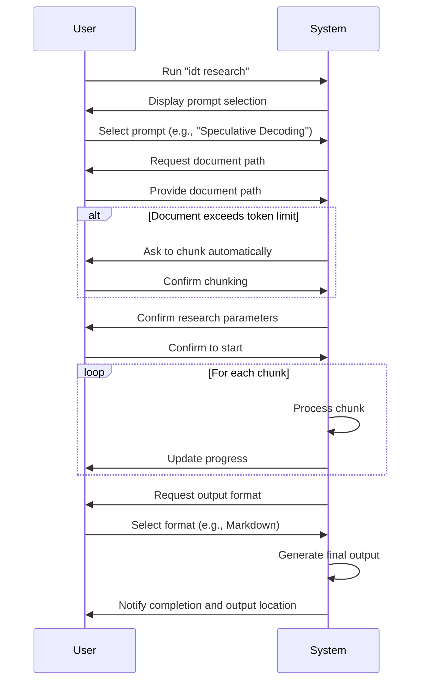

# Diagrams Generated from Visual Aide Snippets

I've created a set of diagrams based on the visual aide snippets from the exported conversation. These diagrams are written in Mermaid markdown syntax, which can be rendered by many markdown viewers and editors.

## Directory Structure

All diagrams are saved in the `diagrams/` directory:

- `README.md` - Overview and instructions for viewing the diagrams
- `progressive_architecture.md` - The five stages of the progressive architecture
- `user_journey_path.md` - The user's progression through different engagement levels
- `data_memory_flow.md` - How data flows through the system with optional components
- `cognitive_interaction_model.md` - The THINK → PLAN → CREATE → CHECK → REFINE → EXECUTE workflow
- `component_interdependency.md` - How components depend on each other
- `phase_transition_validation.md` - Validation checks at each phase transition
- `idt_research_structure.md` - The file structure of the research module
- `interactive_workflow.md` - The sequence of interactions in the research workflow

## Sample Diagram: Progressive Architecture

```mermaid
graph TD
    subgraph "Stage 1 — Lightweight Mode"
        A[Bolt.diy Frontend] --> B[Visual Agent Builder + Process Map]
        B --> C[Basic Memory Storage]
    end
    
    subgraph "Stage 2 — Structured Workflow Mode"
        D[Bolt.diy Frontend] --> E[Enable Structured Mode]
        E --> F[Cursor Memory Bank Activated]
        F --> G[Visual Journey Maps Generated]
    end
    
    subgraph "Stage 3 — Vibe Check Mode"
        H[Cursor Memory Bank] --> I[Vibe Check MCP Server]
        I --> J[Interrupts at major phase transitions]
        I --> K[Suggests course correction if needed]
    end
    
    subgraph "Stage 4 — Approval Mode"
        L[Memory Bank Phase Output] --> M[LLManager Agent]
        M --> N[Formally Approves/Rejects artifacts]
        M --> O[Forces higher quality checkpoints]
    end
    
    subgraph "Stage 5 — Full Collaboration Mode"
        P[Agent Actions / Research Outputs / Build Flows] --> Q[Agent Inbox UI]
        Q --> R[Decision points routed into inbox]
        Q --> S[Human users approve, edit, reject]
    end
    
    subgraph "Execution Layer"
        T[just-prompting MCP Server] --> U[Multi-LLM Dispatching]
        V[OpenManus Orchestration] --> W[Deploy agents with Docker/FastAPI]
    end
```



## Sample Diagram: Interactive Workflow



## Viewing the Diagrams

These diagrams are written in Mermaid markdown syntax. To view them:

1. Use a Markdown viewer that supports Mermaid (like GitHub, VS Code with Mermaid extension, or Obsidian)
2. Copy the content and paste it into an online Mermaid editor like [Mermaid Live Editor](https://mermaid.live/)
3. Use a Mermaid CLI tool to render them to images

## Example Usage

```bash
# Using mermaid-cli to generate an SVG
npx @mermaid-js/mermaid-cli -i diagrams/progressive_architecture.md -o progressive_architecture.svg
```
