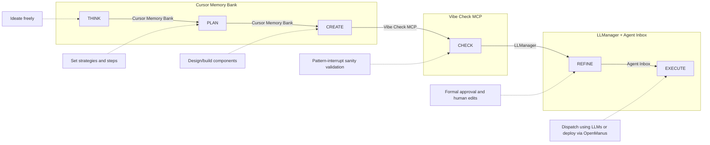

```mermaid
graph LR
    A[THINK] -->|Cursor Memory Bank| B[PLAN]
    B -->|Cursor Memory Bank| C[CREATE]
    C -->|Vibe Check MCP| D[CHECK]
    D -->|LLManager| E[REFINE]
    E -->|Agent Inbox| F[EXECUTE]

    subgraph CursorMemoryBank["Cursor Memory Bank"]
        A
        B
        C
    end

    subgraph VibeCheckMCP["Vibe Check MCP"]
        D
    end

    subgraph LLManagerAgentInbox["LLManager + Agent Inbox"]
        E
        F
    end

    A1[Ideate freely] -.-> A
    B1[Set strategies and steps] -.-> B
    C1[Design/build components] -.-> C
    D1[Pattern-interrupt sanity validation] -.-> D
    E1[Formal approval and human edits] -.-> E
    F1[Dispatch using LLMs or deploy via OpenManus] -.-> F
```
