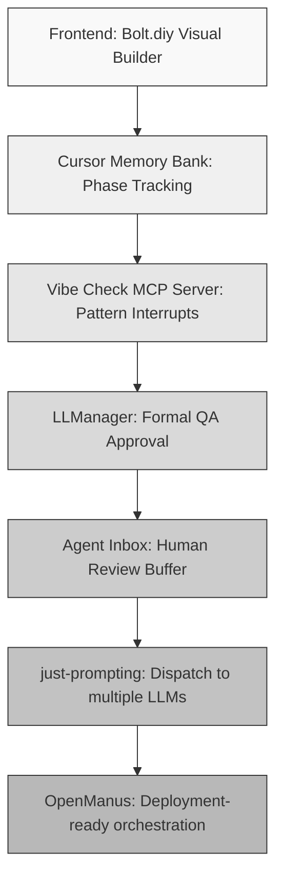

```mermaid
graph TD
    A[Frontend: Bolt.diy Visual Builder] --> B[Cursor Memory Bank: Phase Tracking]
    B --> C[Vibe Check MCP Server: Pattern Interrupts]
    C --> D[LLManager: Formal QA Approval]
    D --> E[Agent Inbox: Human Review Buffer]
    E --> F[just-prompting: Dispatch to multiple LLMs]
    F --> G[OpenManus: Deployment-ready orchestration]
    
    style A fill:#f9f9f9,stroke:#333,stroke-width:1px
    style B fill:#f0f0f0,stroke:#333,stroke-width:1px
    style C fill:#e6e6e6,stroke:#333,stroke-width:1px
    style D fill:#d9d9d9,stroke:#333,stroke-width:1px
    style E fill:#cccccc,stroke:#333,stroke-width:1px
    style F fill:#c2c2c2,stroke:#333,stroke-width:1px
    style G fill:#b8b8b8,stroke:#333,stroke-width:1px
```
