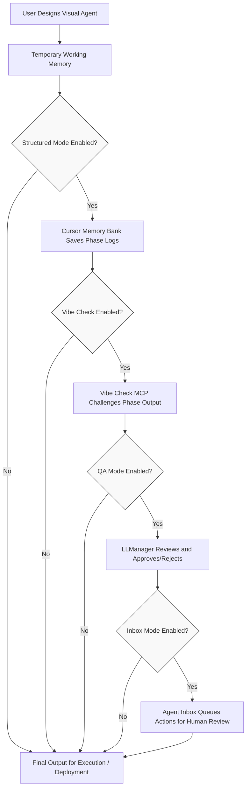

```mermaid
flowchart TD
    A[User Designs Visual Agent] --> B[Temporary Working Memory]
    
    B --> C{Structured Mode Enabled?}
    C -->|Yes| D[Cursor Memory Bank Saves Phase Logs]
    C -->|No| J[Final Output]
    
    D --> E{Vibe Check Enabled?}
    E -->|Yes| F[Vibe Check MCP Challenges Phase Output]
    E -->|No| J
    
    F --> G{QA Mode Enabled?}
    G -->|Yes| H[LLManager Reviews and Approves/Rejects]
    G -->|No| J
    
    H --> I{Inbox Mode Enabled?}
    I -->|Yes| I1[Agent Inbox Queues Actions for Human Review]
    I -->|No| J
    
    I1 --> J[Final Output for Execution / Deployment]
    
    style C fill:#f9f9f9,stroke:#333,stroke-width:1px
    style E fill:#f9f9f9,stroke:#333,stroke-width:1px
    style G fill:#f9f9f9,stroke:#333,stroke-width:1px
    style I fill:#f9f9f9,stroke:#333,stroke-width:1px
```
