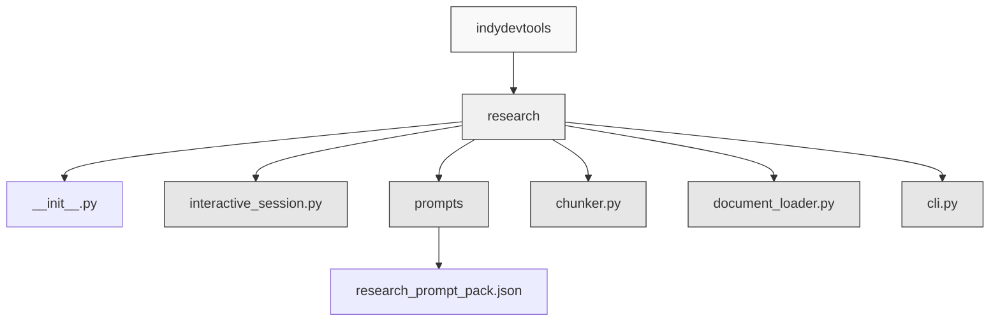

```mermaid
graph TD
    A[indydevtools] --> B[research]
    B --> C[__init__.py]
    B --> D[interactive_session.py]
    B --> E[prompts]
    B --> F[chunker.py]
    B --> G[document_loader.py]
    B --> H[cli.py]
    
    E --> I[research_prompt_pack.json]
    
    style A fill:#f9f9f9,stroke:#333,stroke-width:1px
    style B fill:#f0f0f0,stroke:#333,stroke-width:1px
    style D fill:#e6e6e6,stroke:#333,stroke-width:1px
    style E fill:#e6e6e6,stroke:#333,stroke-width:1px
    style F fill:#e6e6e6,stroke:#333,stroke-width:1px
    style G fill:#e6e6e6,stroke:#333,stroke-width:1px
    style H fill:#e6e6e6,stroke:#333,stroke-width:1px
```
