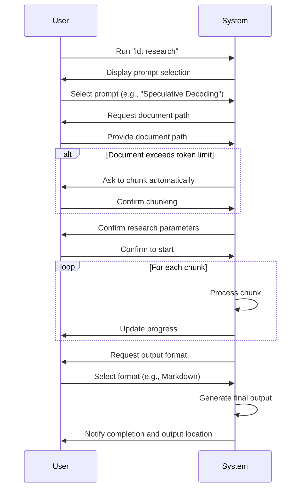

```mermaid
sequenceDiagram
    participant User
    participant System
    
    User->>System: Run "idt research"
    System->>User: Display prompt selection
    User->>System: Select prompt (e.g., "Speculative Decoding")
    System->>User: Request document path
    User->>System: Provide document path
    
    alt Document exceeds token limit
        System->>User: Ask to chunk automatically
        User->>System: Confirm chunking
    end
    
    System->>User: Confirm research parameters
    User->>System: Confirm to start
    
    loop For each chunk
        System->>System: Process chunk
        System->>User: Update progress
    end
    
    System->>User: Request output format
    User->>System: Select format (e.g., Markdown)
    System->>System: Generate final output
    System->>User: Notify completion and output location
```
