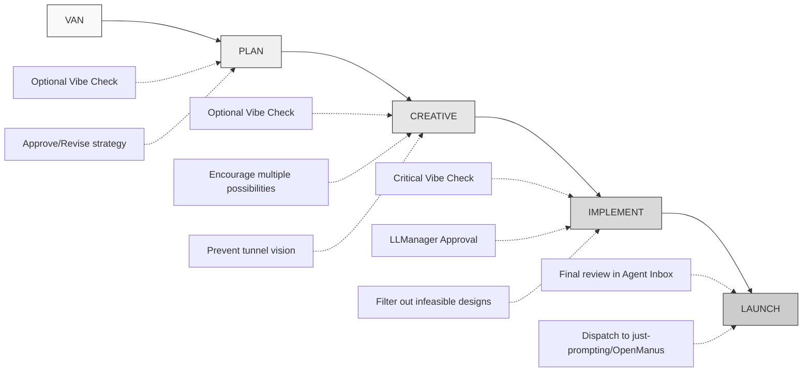

```mermaid
graph LR
    A[VAN] --> B[PLAN]
    B --> C[CREATIVE]
    C --> D[IMPLEMENT]
    D --> E[LAUNCH]
    
    B1[Optional Vibe Check] -.-> B
    B2[Approve/Revise strategy] -.-> B
    
    C1[Optional Vibe Check] -.-> C
    C2[Encourage multiple possibilities] -.-> C
    C3[Prevent tunnel vision] -.-> C
    
    D1[Critical Vibe Check] -.-> D
    D2[LLManager Approval] -.-> D
    D3[Filter out infeasible designs] -.-> D
    
    E1[Final review in Agent Inbox] -.-> E
    E2[Dispatch to just-prompting/OpenManus] -.-> E
    
    style A fill:#f9f9f9,stroke:#333,stroke-width:1px
    style B fill:#f0f0f0,stroke:#333,stroke-width:1px
    style C fill:#e6e6e6,stroke:#333,stroke-width:1px
    style D fill:#d9d9d9,stroke:#333,stroke-width:1px
    style E fill:#cccccc,stroke:#333,stroke-width:1px
```
