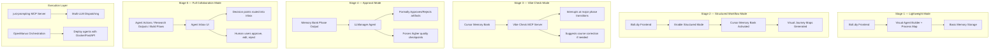

```mermaid
graph TD
    subgraph Stage1["Stage 1 — Lightweight Mode"]
        A[Bolt.diy Frontend] --> B[Visual Agent Builder + Process Map]
        B --> C[Basic Memory Storage]
    end

    subgraph Stage2["Stage 2 — Structured Workflow Mode"]
        D[Bolt.diy Frontend] --> E[Enable Structured Mode]
        E --> F[Cursor Memory Bank Activated]
        F --> G[Visual Journey Maps Generated]
    end

    subgraph Stage3["Stage 3 — Vibe Check Mode"]
        H[Cursor Memory Bank] --> I[Vibe Check MCP Server]
        I --> J[Interrupts at major phase transitions]
        I --> K[Suggests course correction if needed]
    end

    subgraph Stage4["Stage 4 — Approval Mode"]
        L[Memory Bank Phase Output] --> M[LLManager Agent]
        M --> N[Formally Approves/Rejects artifacts]
        M --> O[Forces higher quality checkpoints]
    end

    subgraph Stage5["Stage 5 — Full Collaboration Mode"]
        P[Agent Actions / Research Outputs / Build Flows] --> Q[Agent Inbox UI]
        Q --> R[Decision points routed into inbox]
        Q --> S[Human users approve, edit, reject]
    end

    subgraph ExecutionLayer["Execution Layer"]
        T[just-prompting MCP Server] --> U[Multi-LLM Dispatching]
        V[OpenManus Orchestration] --> W[Deploy agents with Docker/FastAPI]
    end
```
