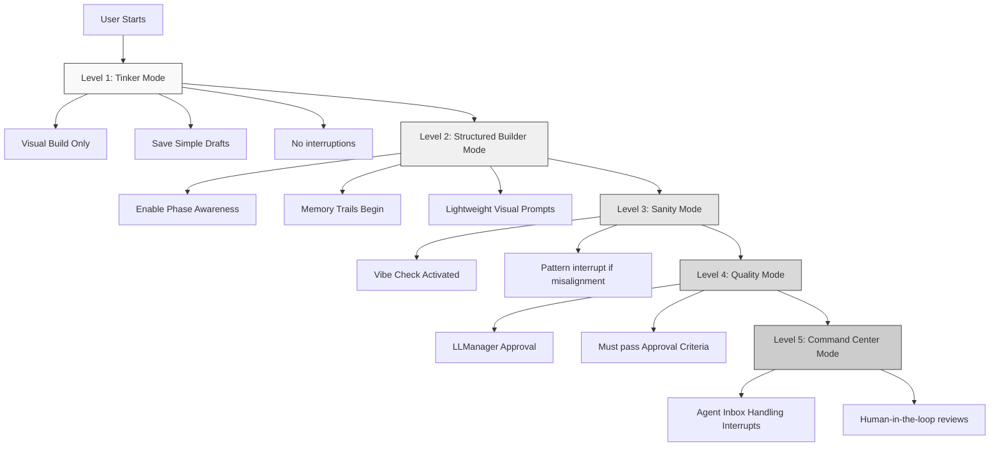

```mermaid
graph TD
    A[User Starts] --> B[Level 1: Tinker Mode]
    B --> B1[Visual Build Only]
    B --> B2[Save Simple Drafts]
    B --> B3[No interruptions]

    B --> C[Level 2: Structured Builder Mode]
    C --> C1[Enable Phase Awareness]
    C --> C2[Memory Trails Begin]
    C --> C3[Lightweight Visual Prompts]

    C --> D[Level 3: Sanity Mode]
    D --> D1[Vibe Check Activated]
    D --> D2[Pattern interrupt if misalignment]

    D --> E[Level 4: Quality Mode]
    E --> E1[LLManager Approval]
    E --> E2[Must pass Approval Criteria]

    E --> F[Level 5: Command Center Mode]
    F --> F1[Agent Inbox Handling Interrupts]
    F --> F2[Human-in-the-loop reviews]

    classDef level1 fill:#f9f9f9,stroke:#333,stroke-width:1px
    classDef level2 fill:#f0f0f0,stroke:#333,stroke-width:1px
    classDef level3 fill:#e6e6e6,stroke:#333,stroke-width:1px
    classDef level4 fill:#d9d9d9,stroke:#333,stroke-width:1px
    classDef level5 fill:#cccccc,stroke:#333,stroke-width:1px

    class B level1
    class C level2
    class D level3
    class E level4
    class F level5
```
